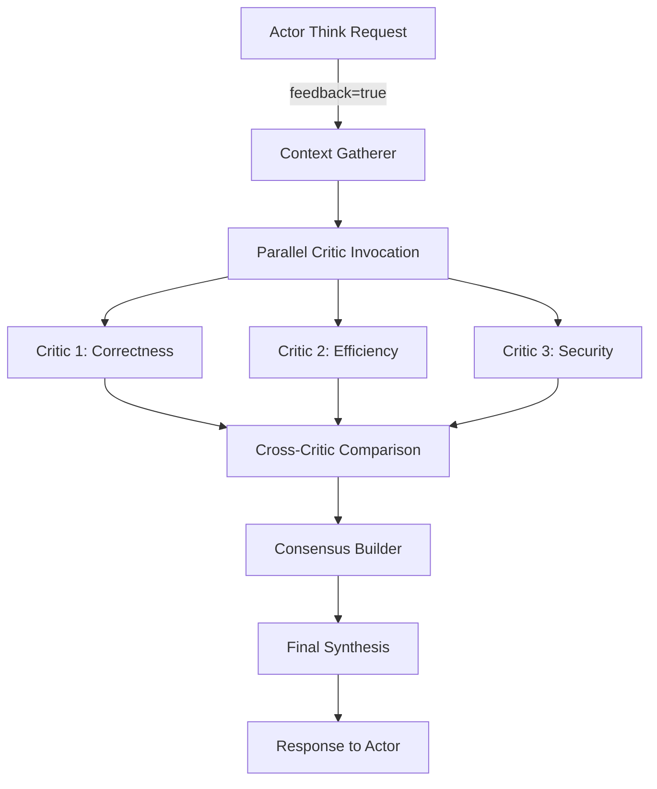

# Product Requirements Document: CodeLoops Multi-Critic Consensus System

**Version:** 1.0  
**Date:** May 2025  
**Author:** CodeLoops Team  
**Status:** Draft

## Executive Summary

This PRD outlines the implementation of an advanced multi-critic consensus system for the CodeLoops MCP (Model Context Protocol). The system enhances the existing actor-critic architecture by introducing a parallel 3-critic review mechanism triggered by a `[feedback]` parameter. When activated, this system orchestrates deep reflection through specialized critics, cross-critic comparison, and consensus synthesis to significantly improve code generation quality and task adherence.

Based on research showing up to 95.1% pass@1 rates on HumanEval benchmarks with multi-agent systems, this implementation targets a minimum 15% improvement in coding performance while maintaining computational efficiency.

## Problem Statement

### Current Limitations
- Single critic model provides limited perspective on complex coding tasks
- Lack of diverse viewpoints leads to missed edge cases and subtle bugs
- No mechanism for deep reflection when facing challenging problems
- Single points of failure in critique quality

### Opportunity
Research demonstrates that multi-critic systems with 3-5 agents consistently outperform single-critic approaches through:
- Diverse perspectives catching different categories of issues
- Consensus mechanisms reducing false positives
- Structured debate improving critique quality
- Specialized roles providing comprehensive coverage

## Solution Overview

### Core Concept
Implement a `[feedback]` parameter for the `actor_think` tool that triggers an enhanced review process involving:
1. **Parallel Analysis**: 3 specialized critic models review the thought with full context
2. **Cross-Validation**: Each critic compares its rationale against the others
3. **Consensus Building**: Structured aggregation of aligned and divergent viewpoints
4. **Final Synthesis**: Comprehensive critique delivered to the requesting model

### Key Benefits
- **Improved Accuracy**: Multiple perspectives reduce blind spots
- **Enhanced Robustness**: Consensus filtering reduces erroneous critiques
- **Deeper Insights**: Cross-critic comparison surfaces nuanced issues
- **Flexible Deployment**: Optional parameter maintains backward compatibility

## Detailed Requirements

### Functional Requirements

#### FR1: Feedback Parameter Trigger
- **FR1.1**: The `actor_think` tool SHALL accept an optional `[feedback]` boolean parameter
- **FR1.2**: When `[feedback]=true`, the system SHALL initiate the multi-critic review process
- **FR1.3**: When `[feedback]=false` or omitted, the system SHALL use the standard single-critic flow

#### FR2: Context Gathering
- **FR2.1**: The system SHALL extract the complete thought from the actor
- **FR2.2**: The system SHALL gather all artifact file contents referenced in the thought
- **FR2.3**: The system SHALL include execution context (previous attempts, error messages if any)
- **FR2.4**: The system SHALL package context into a standardized format for critic consumption

#### FR3: Three-Critic Parallel Review
- **FR3.1**: The system SHALL invoke three critic models in parallel with specialized prompts
- **FR3.2**: Each critic SHALL have access to:
  - The original thought
  - All artifact contents
  - Execution context
  - Task description
- **FR3.3**: Critics SHALL provide structured responses including:
  - Primary critique points
  - Confidence scores (0-1) for each point
  - Specific code examples where applicable
  - Improvement suggestions

#### FR4: Cross-Critic Comparison
- **FR4.1**: The system SHALL perform a secondary call to each critic model
- **FR4.2**: Each critic SHALL receive:
  - Its own initial critique
  - The other two critics' initial critiques
  - The original context
- **FR4.3**: Critics SHALL output:
  - Points of agreement with other critics
  - Points of disagreement with rationale
  - Revised confidence scores
  - Final stance on key issues

#### FR5: Consensus Synthesis
- **FR5.1**: The system SHALL aggregate cross-critic responses to identify:
  - Strong consensus points (3/3 agreement)
  - Majority consensus points (2/3 agreement)
  - Disputed points with rationales
- **FR5.2**: The system SHALL apply confidence-weighted voting for disputed points
- **FR5.3**: The system SHALL preserve high-confidence minority opinions when relevant

#### FR6: Final Critique Generation
- **FR6.1**: The system SHALL make a final call to the primary critic model
- **FR6.2**: The final critic SHALL receive:
  - Original thought and context
  - Consensus analysis from all critics
  - Weighted recommendations
- **FR6.3**: The final critique SHALL be:
  - Concise and actionable
  - Prioritized by impact
  - Include specific improvement suggestions
  - Reference consensus strength for each point

### Non-Functional Requirements

#### NFR1: Performance
- **NFR1.1**: The multi-critic process SHALL complete within 30 seconds for typical requests
- **NFR1.2**: Parallel critic calls SHALL utilize concurrent execution
- **NFR1.3**: The system SHALL implement timeouts (10s per critic call)

#### NFR2: Scalability
- **NFR2.1**: The architecture SHALL support configuration of 3-5 critics
- **NFR2.2**: The system SHALL gracefully degrade if critics fail

#### NFR3: Reliability
- **NFR3.1**: The system SHALL handle partial critic failures
- **NFR3.2**: The system SHALL provide fallback to single-critic mode if needed

## System Architecture

### Component Overview



### Critic Specializations

#### Critic 1: Functional Correctness & Logic
**Focus Areas:**
- Logical consistency and correctness
- Edge case handling
- Algorithm accuracy
- Error handling completeness

**Prompt Template:**
```
You are a specialized code correctness critic. Analyze the provided thought and code artifacts for:
1. Logical errors and inconsistencies
2. Missing edge cases or boundary conditions
3. Incorrect algorithm implementations
4. Inadequate error handling

Provide specific examples and rate confidence (0-1) for each issue identified.
Consider the execution context and previous attempts when available.
```

#### Critic 2: Code Quality & Efficiency
**Focus Areas:**
- Performance optimization
- Code maintainability
- Best practices adherence
- Resource utilization

**Prompt Template:**
```
You are a specialized code efficiency critic. Evaluate the provided thought and code artifacts for:
1. Algorithmic complexity and optimization opportunities
2. Code reusability and maintainability
3. Adherence to language-specific best practices
4. Memory and computational efficiency

Identify specific inefficiencies and suggest improvements with confidence ratings (0-1).
```

#### Critic 3: Security & Robustness
**Focus Areas:**
- Security vulnerabilities
- Input validation
- Safe coding practices
- Defensive programming

**Prompt Template:**
```
You are a specialized security critic. Examine the provided thought and code artifacts for:
1. Security vulnerabilities (injection, XSS, etc.)
2. Missing input validation or sanitization
3. Unsafe operations or practices
4. Potential attack vectors

Highlight security risks with severity ratings and confidence scores (0-1).
```

### Data Flow

1. **Request Phase**
   ```json
   {
     "action": "actor_think",
     "thought": "...",
     "feedback": true,
     "context": {
       "task": "...",
       "artifacts": ["file1.py", "file2.js"],
       "previous_attempts": []
     }
   }
   ```

2. **Critic Response Format**
   ```json
   {
     "critic_id": "correctness",
     "critiques": [
       {
         "issue": "Missing null check in function X",
         "severity": "high",
         "confidence": 0.9,
         "suggestion": "Add null validation before accessing property",
         "code_example": "..."
       }
     ]
   }
   ```

3. **Consensus Format**
   ```json
   {
     "consensus_points": [
       {
         "issue": "...",
         "agreement_level": "unanimous|majority|disputed",
         "critics_agreeing": ["correctness", "efficiency"],
         "confidence_weighted_score": 0.85
       }
     ],
     "minority_opinions": []
   }
   ```

## Implementation Plan

### Phase 1: Foundation (Week 1-2)
- Implement `[feedback]` parameter parsing
- Create context gathering module
- Set up parallel critic invocation infrastructure

### Phase 2: Critic Implementation (Week 3-4)
- Develop specialized critic prompts
- Implement structured response parsing
- Create critic response validation

### Phase 3: Consensus Mechanism (Week 5-6)
- Build cross-critic comparison logic
- Implement confidence-weighted voting
- Develop consensus aggregation algorithms

### Phase 4: Integration & Testing (Week 7-8)
- Integrate with existing CodeLoops MCP
- Comprehensive testing with real coding tasks
- Performance optimization

### Phase 5: Refinement (Week 9-10)
- Tune critic prompts based on results
- Optimize consensus algorithms
- Documentation and deployment

## Success Metrics

### Primary Metrics
- **Code Quality Improvement**: ≥15% reduction in bugs found in post-generation testing
- **Task Completion Rate**: ≥20% improvement on complex coding tasks
- **Edge Case Detection**: ≥30% improvement in identifying edge cases

### Secondary Metrics
- **Response Time**: <30 seconds for 95% of feedback requests
- **Consensus Rate**: >70% unanimous or majority agreement
- **User Satisfaction**: Measured through A/B testing

### Monitoring & Evaluation
- Track critic agreement rates
- Monitor confidence score accuracy
- Analyze performance impact
- Collect user feedback on critique quality

## Risk Mitigation

### Technical Risks
| Risk | Mitigation |
|------|------------|
| Increased latency | Parallel execution, caching, timeouts |
| Critic disagreement deadlock | Weighted voting, fallback mechanisms |
| Context size limitations | Intelligent context pruning, summarization |
| Model drift | Regular prompt tuning, performance monitoring |

### Operational Risks
| Risk | Mitigation |
|------|------------|
| Increased API costs | Optional activation, usage monitoring |
| Complexity for users | Clear documentation, sensible defaults |
| Maintenance overhead | Modular design, comprehensive testing |

## Future Enhancements

### Version 2.0 Considerations
- Dynamic critic selection based on task type
- Learnable critic weights based on historical performance
- Integration with external code analysis tools
- Support for domain-specific critics (web, ML, systems)

### Long-term Vision
- Self-improving critic system using reinforcement learning
- Hierarchical critic networks for complex projects
- Cross-project learning and pattern recognition
- Integration with IDE and development workflows

## Appendix A: Research References

Key research validating the multi-critic approach:
- CodeTree: 95.1% pass@1 on HumanEval with 4-agent system
- INDICT: +10% improvement across all model sizes with dual critics
- ReConcile: 11.4% improvement with round-table consensus
- N-Critics Framework: Consistent improvements in code correctness

## Appendix B: Configuration Schema

```yaml
multi_critic_config:
  enabled: true
  num_critics: 3
  timeout_seconds: 10
  consensus_threshold: 0.66
  preserve_minority_opinions: true
  critics:
    - id: correctness
      model: "claude-3-opus"
      temperature: 0.3
      role: "functional_correctness"
    - id: efficiency
      model: "claude-3-opus"
      temperature: 0.4
      role: "code_quality"
    - id: security
      model: "claude-3-opus"
      temperature: 0.3
      role: "security_robustness"
```

## Approval & Sign-off

| Role | Name | Date | Signature |
|------|------|------|-----------|
| Product Owner | | | |
| Tech Lead | | | |
| Engineering Manager | | | |
| QA Lead | | | |